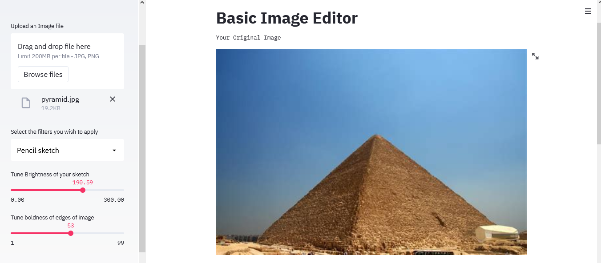
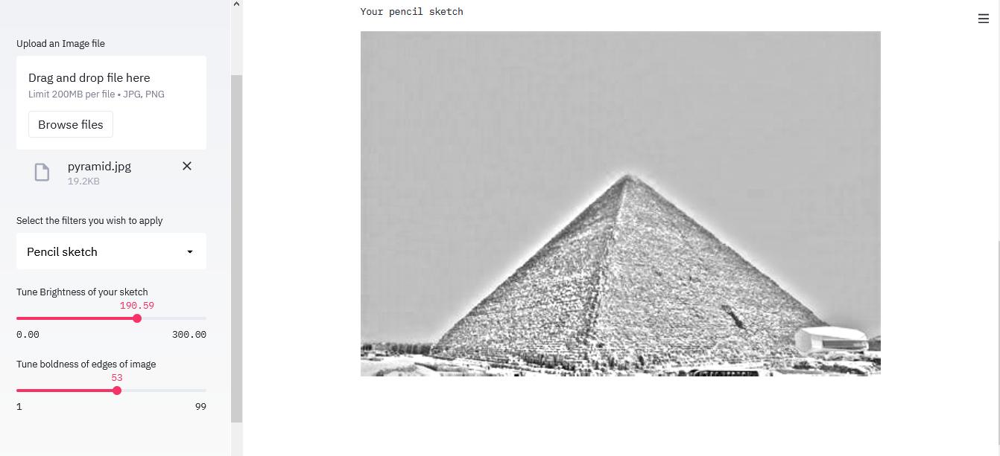

## Sketchify
#### This is a simple image cartoonisation web app created with Streamlit and OpenCV :heart:.
##### Any image can be converted to cartoon using edge detection and region smoothing

## Link to webapp

http://image-cartoonizer.herokuapp.com

  

It has got 4 basic filters
- Pencil sketch
- Pencil edge
- Bilateral filter
- Detail enhancement filter

#### Pencil Sketch
We first convert the image to gray mode, then use a GaussianBlur filter for image smoothing. The user can choose a kernel size to adjust the **Boldness** of the image. Then we simply divie the orginal image with the blurred image with a value selected by the user, also labelled as **Sharpness**.

#### Pencil Edge
We first convert the image to grayscale, then apply a medianBlur() filter using a kernel size from the user which adjusts the **sharpness** of the image. Then we apply a Laplacian filter to detect the edges, using a kernel size taken input from user to adjust the __Edge Detection Power__. Then we invert the result of the Laplacian so that darker gray color becomes brighter and vice versa. Then we apply threshold() filter to convert the grayscale image to either complete black or white, depending upon a threshold input from the user as __Noise effects__.

#### Bilateral Filter
Image converted to grayscale, applied a medianBlur() filter with a kernel termed as __Sharpness__ to the user. Then we apply __adaptiveThreshold()__ filter which converts pixel values in each region into either completely black or completely white depending on the mean pixel value overlapped by the kernel. The kernel size is taken to be (9,9). For more info, visit the OpenCV docs. Then we apply the __bilateralFilter()__ on the original image  with a kernel size *smooth* taken imput from user as **Smoothness**. Then we simply *bitwise_and* the last image using the result from adaptiveThreshold() as mask.

#### Detail Enhancement filter
This is almost same as Bilateral filter, except, we apply a **detailEnhance()** filter instead of the *bilateralFilter()*. It has 2 parameters which we take input from the user. A **sigma_s** parameter which specifies the *smoothness* of the image. Another **sigma_r** which preserves the edges while image smoothing. Small value leads to similar colors being averaged, while colors that differ much will stay intact. This is taken input from user as **tune color averaging effects**. Then we use the result of adaptive threshold as a mask. Then, merge the result of the detail enhancement filter based on the value of the mask to create well-defined edges, which is the basis for cartoonisation. 

### A procfile is a special file that specifies the commands that are executed by the app on startup. You can use a Procfile to declare a variety of process types.
For more info, visit https://devcenter.heroku.com/articles/procfile
